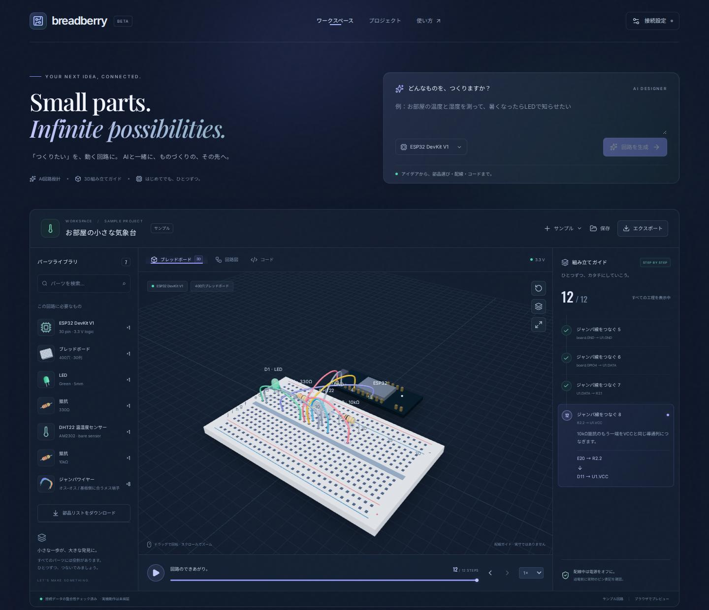
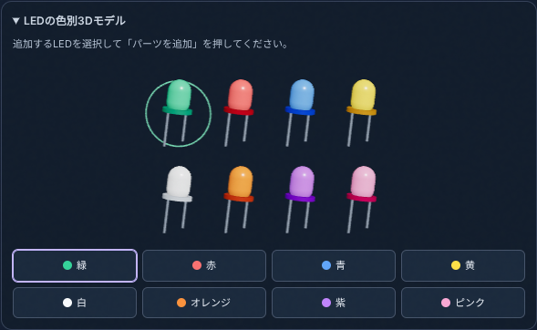

# breadberry

**想像を、つなごう。** アイデアから回路設計・部品表・3D組み立てガイドまでをつなぐ、日本語の電子工作ワークスペースです。

Next.js / TypeScript / Tailwind CSS / Three.js（React Three Fiber）/ Gemini API / GMI Cloud / Cloud Firestore。Fritzingの部品・回路・インスペクターという構成を参考にした、オリジナルのダッシュボードです。



## できること

- 自然言語の要望と基板を入力し、Geminiの構造化JSON出力で回路・部品・配線・ファームウェアを生成
- GMI Cloudのモデルが電圧、配線、ピン番号、コードの整合性について補助レビュー
- 部品配置とジャンパ線をひとつずつ3Dで描画。再生、一時停止、工程移動、速度変更、回転、ズーム、真上表示、全画面
- 穴番号と端子名を記載した工程ガイド、回路接続図、コード表示
- 部品表CSV、回路JSON、Python/C++コードのダウンロード
- Firestoreへの自動保存とプロジェクトの再表示
- キーなしで使える温湿度計／LEDブリンクのサンプル。サンプルはブラウザ保存で、AI生成を装いません
- PC、タブレット、スマートフォン対応。指定フォントはローカル配信

3Dの形状をAIに自由に出力させるのではなく、**Geminiの回路ネットリストからあらかじめ定義した部品形状を決定的に配置**します。部品表・穴番号・3D・接続図・工程は同じデータを参照します。

## LEDの色別3Dモデル

緑・赤・青・黄・白・オレンジ・紫・ピンクの8種類のglTFモデルを用意しています。Editorの「LEDの色別3Dモデル」でプレビューを選び、「パーツを追加」で配置できます。配置後は「LEDの色」で変更でき、部品一覧・接続図にも同じ色が反映されます。

モデルは `public/models/led/led-{color}.gltf` に保存しています。レンズ・台座・長短の脚を含む自己完結したファイルで、モデルの再生成は `node --import tsx scripts/generate-led-models.ts` で行えます。



## チャットで回路を修正する

画面右側の「回路設計チャット」に変更内容を入力して「回路を修正」を押します。表示中の回路と、それまでの会話をGeminiに渡し、部品表・3D・回路図・コード・組み立て工程を更新します。サンプルや以前の保存データからも修正を始められます。

- 「抵抗を470Ωにして」→「LEDの点滅を1秒間隔にして」のように繰り返し送信できます。Ctrl / ⌘ + Enterでも送信できます。
- 「新しい回路」を選ぶと、次の送信で表示中の回路・会話を引き継がずに生成します。
- 成功した修正ごとに、会話履歴を含むプロジェクトを新しいIDで保存します。「プロジェクト」から開くと、その時点の回路と履歴を復元します。古いプロジェクトの履歴は空として扱います。
- 生成失敗時は回路・履歴・入力を保持し、再試行できます。生成中の二重送信や回路の切り替えを防止します。
- Firestore保存失敗時はブラウザ保存へ切り替えます。ブラウザ保存は従来どおり最新20件までです。JSONエクスポートにも会話履歴を含みます。
- 1回の入力は1〜2000文字、1つの会話は最大50往復です。既存の日次生成上限は修正にも適用されます。スマートフォンではチャットを回路の下に表示します。

`POST /api/generate` は従来の `{ prompt, board }` に加え、任意の `context: { circuit, messages }` を受け取ります。`messages` は `{ role: "user" | "assistant", content: string }` の配列です。入力サイズ・会話・修正元の回路を検査し、生成結果も従来の接続検査を通してから保存します。応答の `messages` に今回の依頼と生成された回路の説明を追加します。

## セットアップ

Node.js 24 と npm が必要です。

```bash
npm ci
npm run dev
```

[http://localhost:3000](http://localhost:3000) を開くと、そのままサンプルを操作できます。

AI生成とFirestore保存を有効にする場合：

```bash
cp .env.example .env.local
openssl rand -hex 32
```

出力した乱数を `SESSION_SECRET` に設定し、次の値を `.env.local` に記入します。**APIキーをブラウザ用の `NEXT_PUBLIC_` 変数に入れないでください。**

| 変数                     | 用途                                                              |
| ------------------------ | ----------------------------------------------------------------- |
| `GEMINI_API_KEY`         | Google AI Studioで発行したAPIキー                                 |
| `GEMINI_MODEL`           | 既定 `gemini-3.8-flash`。利用可能な構造化出力対応モデルに変更可能 |
| `GMI_API_KEY`            | GMI CloudのAPIキー。未設定時はレビュー未実施と表示                |
| `GMI_MODEL`              | 既定 `Qwen/Qwen3.8-Flash`                                        |
| `GMI_BASE_URL`           | 既定 `https://api.gmi-serving.com/v1`。HTTPSのみ                  |
| `GOOGLE_CLOUD_PROJECT`   | Firestoreを作成したGoogle CloudプロジェクトID                     |
| `FIRESTORE_DATABASE_ID`  | 既定 `(default)`                                                  |
| `SESSION_SECRET`         | 32文字以上のランダムな署名キー                                    |
| `APP_ORIGIN`             | リバースプロキシ使用時の実際のアクセス元URL。末尾 `/` なし        |
| `DAILY_GENERATION_LIMIT` | アプリ全体の1日生成上限。既定200                                  |
| `SESSION_DAILY_LIMIT`    | セッションごとの1日生成上限。既定20                               |

### ローカルでGeminiを使う

`.env.local` に `GEMINI_API_KEY` と `SESSION_SECRET` を設定してローカルサーバーを起動すると、Gemini APIをサーバー側から呼び出します。APIキーはブラウザへ送信されません。ローカル・Cloud Runともにアクセスコードの入力は不要で、セッションは自動開始します。旧設定の `APP_ACCESS_TOKEN` が残っていてもアクセスコードは要求しません。

ローカルから本物のFirestoreを使う場合は、gcloud CLIでADCを設定します。

```bash
gcloud auth application-default login
gcloud auth application-default set-quota-project YOUR_PROJECT_ID
```

ADCのユーザーにFirestoreの読み書き権限が必要です。環境変数設定後にサーバーを再起動し、画面を再読み込みしてください。セッションは自動開始します。

### Firestoreエミュレーター

JavaとFirebase CLIがある環境では、別ターミナルで以下を実行できます。

```bash
firebase emulators:start --only firestore --project demo-breadberry
```

`.env.local` に `GOOGLE_CLOUD_PROJECT=demo-breadberry`、`FIRESTORE_EMULATOR_HOST=127.0.0.1:8081` を設定します。Gemini/GMIは引き続き実APIです。通常のユニットテストはAPIをモックするため、料金は発生しません。

### 本番形式でローカル起動

```bash
npm run build
npm start
```

Next.js standaloneを起動します。`PORT` は既定3000です。

## Docker

Docker Compose v2.24以上を使用します。キーなしでもサンプルが動きます。

```bash
docker compose up --build
```

[http://localhost:8080](http://localhost:8080) を開きます。AIを使うときは `.env.example` を `.env` にコピーして設定してください。Docker内にホストのADCは自動で入りません。実FirestoreをローカルDockerから利用する場合：

```bash
export GOOGLE_ADC_FILE="$HOME/.config/gcloud/application_default_credentials.json"
docker compose -f compose.yaml -f compose.gcp.yaml up --build
```

ADCは読み取り専用マウントです。認証情報をイメージに含めません。Cloud RunではサービスアカウントのADCを自動使用するため、このマウントは不要です。

## Cloud Runにデプロイ

課金が有効なGoogle Cloudプロジェクト、gcloud CLI、デプロイ権限が必要です。以下は自分のプロジェクトで実行してください。

### 1. API・データベース・イメージ保管先

```bash
export GOOGLE_CLOUD_PROJECT=YOUR_PROJECT_ID
export REGION=asia-northeast1

gcloud services enable run.googleapis.com cloudbuild.googleapis.com \
  artifactregistry.googleapis.com firestore.googleapis.com secretmanager.googleapis.com \
  --project "$GOOGLE_CLOUD_PROJECT"

gcloud artifacts repositories create breadberry --repository-format=docker \
  --location "$REGION" --project "$GOOGLE_CLOUD_PROJECT"

gcloud firestore databases create --database='(default)' --type=firestore-native \
  --location "$REGION" --project "$GOOGLE_CLOUD_PROJECT"
```

すでに存在するリポジトリ／データベースの作成は省略します。Firestoreのロケーションは作成後変更できません。既存の構成がある場合はそちらを利用してください。

### 2. 実行用サービスアカウント

```bash
gcloud iam service-accounts create breadberry-runtime --project "$GOOGLE_CLOUD_PROJECT"
export RUNTIME_SA="breadberry-runtime@${GOOGLE_CLOUD_PROJECT}.iam.gserviceaccount.com"
gcloud projects add-iam-policy-binding "$GOOGLE_CLOUD_PROJECT" \
  --member="serviceAccount:${RUNTIME_SA}" --role=roles/datastore.user
```

Cloud Buildで使うビルド用サービスアカウントには、対象Artifact Registryへの書き込みとビルドログの書き込み権限が必要です。実行アカウントは組織設定により異なります。デプロイするユーザーにはCloud Runのデプロイ権限、対象Artifact Registryリポジトリへの `roles/artifactregistry.reader`、`breadberry-runtime` に対するService Account User権限が必要です。

### 3. Secret Manager

デプロイ前に、次の5個のシークレットをGoogle Cloud Consoleで作成し、値を登録します。

- `breadberry-gemini-key`：Gemini APIキー
- `breadberry-gmi-key`：GMI Cloud APIキー
- `breadberry-session-secret`：`openssl rand -hex 32` で生成する値
- `breadberry-digikey-client-id`：DigiKey Production AppのClient ID
- `breadberry-digikey-client-secret`：DigiKey Production AppのClient Secret

各シークレットに実行アカウントの読み取り権限を付けます。

```bash
for SECRET in breadberry-gemini-key breadberry-gmi-key breadberry-session-secret breadberry-digikey-client-id breadberry-digikey-client-secret; do
  gcloud secrets add-iam-policy-binding "$SECRET" --project "$GOOGLE_CLOUD_PROJECT" \
    --member="serviceAccount:${RUNTIME_SA}" --role=roles/secretmanager.secretAccessor
done
```

### 4. ビルド・デプロイ

```bash
make deploy
```

`scripts/deploy.sh` がCloud BuildでDockerをビルドし、Cloud Runへデプロイします。東京リージョン、1GiBメモリ、最大3インスタンス、180秒タイムアウト、**IAMで保護された非公開サービス**が既定です。環境変数 `REGION` / `SERVICE` / `SERVICE_ACCOUNT` で変更できます。

`APP_ORIGIN` を指定して実行すると、そのURLを操作の送信元として許可します（末尾 `/` なし）。未指定の場合はCloud Runに設定済みの値を保持します。他の追加済み環境変数も再デプロイ時に保持します。

`scripts/deploy.sh` はDigiKeyを含む上記5個のシークレットを `--update-secrets` でCloud Runの実行時環境変数に自動登録します。各シークレットの参照は `latest` に更新し、それ以外の追加シークレット参照は保持します。DigiKeyの2個もデプロイ前に作成・権限付与が必要です。`DIGIKEY_SANDBOX` は既定で `false` を登録します。旧 `APP_ACCESS_TOKEN` のシークレット参照はデプロイ時に解除します。Secret Managerのシークレット自体は削除しません。Cloud RunのIAMアクセス制御は従来どおりです。

一度Cloud RunのURLを `APP_ORIGIN` に設定済みなら、以降は `make deploy` だけで再デプロイできます。毎回 `gcloud run services update --update-env-vars APP_ORIGIN=...` を実行する必要はありません。URLを変更する場合や、localhost用の設定から戻す場合にだけ更新してください。

`make deploy` は `.env.local` を読み込みません。モデルを変更する場合は `GEMINI_MODEL=gemini-3.8-flash make deploy` のように環境変数で指定してください。Gemini 2.5 Flashはモデル一覧に表示されても、新規ユーザーの生成リクエストが404で拒否される場合があります。

### GitHub ActionsでPRマージ時にデプロイ

`.github/workflows/deploy.yml` は、`main` 向けPRがマージされたときだけ `make deploy` を実行します。GitHub Actions用のサービスアカウント鍵は作成せず、GitHub OIDCとWorkload Identity Federation（WIF）で短時間の認証情報を発行します。

初回だけ、デプロイ用サービスアカウントとWIFプロバイダを設定します。`YOUR_PROJECT_ID` と `YOUR_GITHUB_OWNER` はそれぞれ置き換えてください。

```bash
export GOOGLE_CLOUD_PROJECT=YOUR_PROJECT_ID
export GITHUB_OWNER=YOUR_GITHUB_OWNER
export GITHUB_REPOSITORY=breadberry
export DEPLOY_SA=breadberry-github-deploy

gcloud iam service-accounts create "$DEPLOY_SA" --project "$GOOGLE_CLOUD_PROJECT"
gcloud projects add-iam-policy-binding "$GOOGLE_CLOUD_PROJECT" \
  --member="serviceAccount:${DEPLOY_SA}@${GOOGLE_CLOUD_PROJECT}.iam.gserviceaccount.com" \
  --role=roles/cloudbuild.builds.editor
gcloud projects add-iam-policy-binding "$GOOGLE_CLOUD_PROJECT" \
  --member="serviceAccount:${DEPLOY_SA}@${GOOGLE_CLOUD_PROJECT}.iam.gserviceaccount.com" \
  --role=roles/run.admin
gcloud artifacts repositories add-iam-policy-binding "${REPOSITORY:-breadberry}" \
  --project "$GOOGLE_CLOUD_PROJECT" --location "${REGION:-asia-northeast1}" \
  --member="serviceAccount:${DEPLOY_SA}@${GOOGLE_CLOUD_PROJECT}.iam.gserviceaccount.com" \
  --role=roles/artifactregistry.reader --condition=None
gcloud projects add-iam-policy-binding "$GOOGLE_CLOUD_PROJECT" \
  --member="serviceAccount:${DEPLOY_SA}@${GOOGLE_CLOUD_PROJECT}.iam.gserviceaccount.com" \
  --role=roles/serviceusage.serviceUsageConsumer
gcloud projects add-iam-policy-binding "$GOOGLE_CLOUD_PROJECT" \
  --member="serviceAccount:${DEPLOY_SA}@${GOOGLE_CLOUD_PROJECT}.iam.gserviceaccount.com" \
  --role=roles/storage.bucketViewer
gcloud storage buckets add-iam-policy-binding "gs://${GOOGLE_CLOUD_PROJECT}_cloudbuild" \
  --member="serviceAccount:${DEPLOY_SA}@${GOOGLE_CLOUD_PROJECT}.iam.gserviceaccount.com" \
  --role=roles/storage.legacyBucketWriter
gcloud storage buckets add-iam-policy-binding "gs://${GOOGLE_CLOUD_PROJECT}_cloudbuild" \
  --member="serviceAccount:${DEPLOY_SA}@${GOOGLE_CLOUD_PROJECT}.iam.gserviceaccount.com" \
  --role=roles/storage.objectAdmin
gcloud iam service-accounts add-iam-policy-binding \
  "breadberry-runtime@${GOOGLE_CLOUD_PROJECT}.iam.gserviceaccount.com" \
  --member="serviceAccount:${DEPLOY_SA}@${GOOGLE_CLOUD_PROJECT}.iam.gserviceaccount.com" \
  --role=roles/iam.serviceAccountUser

# Cloud Build の実行アカウントを使用する権限（Cloud Run 実行用とは別）
BUILD_SA="$(gcloud builds get-default-service-account --project "$GOOGLE_CLOUD_PROJECT")"
gcloud iam service-accounts add-iam-policy-binding "$BUILD_SA" \
  --project "$GOOGLE_CLOUD_PROJECT" \
  --member="serviceAccount:${DEPLOY_SA}@${GOOGLE_CLOUD_PROJECT}.iam.gserviceaccount.com" \
  --role=roles/iam.serviceAccountUser --condition=None

gcloud iam workload-identity-pools create github --location=global \
  --display-name="GitHub Actions" --project "$GOOGLE_CLOUD_PROJECT"
gcloud iam workload-identity-pools providers create-oidc github \
  --location=global --workload-identity-pool=github \
  --display-name="GitHub Actions" \
  --attribute-mapping="google.subject=assertion.sub,attribute.repository=assertion.repository" \
  --attribute-condition="assertion.repository=='${GITHUB_OWNER}/${GITHUB_REPOSITORY}'" \
  --issuer-uri="https://token.actions.githubusercontent.com" \
  --project "$GOOGLE_CLOUD_PROJECT"

export PROJECT_NUMBER="$(gcloud projects describe "$GOOGLE_CLOUD_PROJECT" --format='value(projectNumber)')"
gcloud iam service-accounts add-iam-policy-binding \
  "${DEPLOY_SA}@${GOOGLE_CLOUD_PROJECT}.iam.gserviceaccount.com" \
  --role=roles/iam.workloadIdentityUser \
  --member="principalSet://iam.googleapis.com/projects/${PROJECT_NUMBER}/locations/global/workloadIdentityPools/github/attribute.repository/${GITHUB_OWNER}/${GITHUB_REPOSITORY}"
```

`gcloud builds submit` は、既定のソース保存バケットが対象プロジェクトに属することをバケット一覧で確認します。そのため、バケット単位の書き込み権限に加えて、プロジェクト単位で `storage.buckets.list` を含む `roles/storage.bucketViewer` が必要です。`The user is forbidden from accessing the bucket` が出る場合は、`serviceusage.serviceUsageConsumer` だけでなく、このロールもデプロイ用サービスアカウントに付いているか確認してください。ロールの権限は [Cloud Storage の公式ドキュメント](https://docs.cloud.google.com/storage/docs/access-control/iam-roles) を参照してください。

ビルド後の `gcloud run deploy` で `artifactregistry.repositories.downloadArtifacts` が拒否される場合は、エラーに表示されたデプロイ用サービスアカウントに、対象リポジトリの `roles/artifactregistry.reader` が付いているか確認してください。Cloud Build実行アカウントの書き込み権限とは別に必要です。上記の `gcloud artifacts repositories add-iam-policy-binding` を、対象リポジトリのIAMポリシーを変更できる管理者として実行し、GitHub Actionsの失敗したジョブを再実行してください。`REGION` / `REPOSITORY` は、GitHub Actionsの `GCP_REGION` / `ARTIFACT_REPOSITORY` と同じ値にします。詳細は [Cloud Runのデプロイに必要なロール](https://docs.cloud.google.com/run/docs/deploying#required_roles) を参照してください。

`caller does not have permission to act as service account` が出る場合は、デプロイ用アカウントに **Cloud Build 実行アカウントに対する** `roles/iam.serviceAccountUser` が不足しています。`roles/cloudbuild.builds.editor` や Cloud Run 実行用アカウントへの権限付与だけでは足りません。上記の `BUILD_SA` の取得と権限付与を、対象サービスアカウントの IAM ポリシーを変更できる管理者として実行し、GitHub Actions の失敗したジョブを再実行してください。プロジェクト全体への Service Account User 付与は不要です。

`scripts/deploy.sh` は Cloud Build の既定アカウントを使用します。既定値はプロジェクト設定によって異なるため、メールアドレスを推測せず `gcloud builds get-default-service-account` で確認します。旧 Cloud Build アカウント（`PROJECT_NUMBER@cloudbuild.gserviceaccount.com`）の場合は、このアカウントへの IAM バインディングを追加できず、上記の Cloud Build 用権限付与は不要です。詳細は [Cloud Build の既定サービスアカウント変更](https://docs.cloud.google.com/build/docs/cloud-build-service-account-updates) を参照してください。

GitHubリポジトリの **Settings > Secrets and variables > Actions > Variables** に次を設定します。Cloud Run実行用の秘密値は従来どおりSecret Managerを参照するため、GitHubには登録しません。

| 変数                                        | 値                                                                                       |
| ------------------------------------------- | ---------------------------------------------------------------------------------------- |
| `GOOGLE_CLOUD_PROJECT`                      | Google CloudプロジェクトID                                                               |
| `GCP_WORKLOAD_IDENTITY_PROVIDER`            | `projects/PROJECT_NUMBER/locations/global/workloadIdentityPools/github/providers/github` |
| `GCP_DEPLOY_SERVICE_ACCOUNT`                | `breadberry-github-deploy@YOUR_PROJECT_ID.iam.gserviceaccount.com`                       |
| `CLOUD_RUN_RUNTIME_SERVICE_ACCOUNT`         | `breadberry-runtime@YOUR_PROJECT_ID.iam.gserviceaccount.com`                             |
| `GCP_REGION`                                | 任意。未指定時は `asia-northeast1`                                                       |
| `CLOUD_RUN_SERVICE`                         | 任意。未指定時は `breadberry`                                                            |
| `ARTIFACT_REPOSITORY`                       | 任意。未指定時は `breadberry`                                                            |
| `GEMINI_MODEL` / `GMI_MODEL` / `APP_ORIGIN` | 任意。ローカルの同名環境変数と同じ用途                                                   |

`production` Environmentを作成して承認者を設定すると、マージ後のデプロイ前にGitHub上で承認を必須にできます。Cloud Build実行用サービスアカウントには、従来どおりArtifact Registryへの書き込み権限が必要です。

非公開のまま自分で確認するには、まずlocalhostを許可してプロキシを起動します：

```bash
gcloud run services update breadberry --region "$REGION" \
  --project "$GOOGLE_CLOUD_PROJECT" \
  --update-env-vars 'APP_ORIGIN=http://localhost:8080'

gcloud run services proxy breadberry --region "$REGION" \
  --project "$GOOGLE_CLOUD_PROJECT" --port 8080
```

[http://localhost:8080](http://localhost:8080) を開きます。`127.0.0.1` や別のポートは異なる送信元として扱われるため、設定と同じURLを使ってください。

Cloud RunのURLでアクセスするときは、許可する送信元をそのURLに切り替えます：

```bash
export APP_ORIGIN="https://YOUR_SERVICE_URL"
gcloud run services update breadberry --region "$REGION" \
  --project "$GOOGLE_CLOUD_PROJECT" \
  --update-env-vars "APP_ORIGIN=${APP_ORIGIN}"
```

現在の実装で許可する送信元は1つです。localhostと公開URLの両方を同時には指定できません。「この送信元からは操作できません。」という403は、セッション開始などの操作時にブラウザの送信元と許可URLが一致しない場合にアプリが返します。Cloud RunのIAM認証による `Error: Forbidden` とは別の設定です。

一般公開する場合は、Cloud RunのInvoker権限を運用に合わせて変更してください。公開URLに合わせて `APP_ORIGIN` を設定します。本格的な複数ユーザー運用にはFirebase Authentication等の認証を追加してください。

Firestoreのクライアント直接アクセスを禁止するルールと、生成回数カウンターの7日TTLを適用できます。

```bash
firebase deploy --only firestore --project "$GOOGLE_CLOUD_PROJECT"
```

このルールはデータベース全体のクライアントアクセスを禁止します。既存アプリとデータベースを共用する場合は、ルールを統合してから適用してください。サーバーSDKのアクセスはIAMで管理します。

## 対応範囲と設計

| 対象               | 対応内容                                                              |
| ------------------ | --------------------------------------------------------------------- |
| ESP32              | ESP32-WROOMの30ピンDevKit V1を想定。S3/C3や38ピン基板とは異なる    |
| Raspberry Pi Pico  | RP2040のPico。MicroPython                                            |
| Raspberry Pi 4 / 5 | 40ピンGPIOヘッダー。BCM番号と物理番号を区別。Linux上のPython       |
| 部品               | LED、抵抗、DHT22、押しボタン、BH1750、CdS、および下表の追加9種類（計15種類） |
| アナログ部品       | CdS・NTC・可変抵抗はESP32 ADC1 / Pico ADCを使用。Pi 4/5はADC非搭載のため対象外 |
| 規模               | 1枚の30列ブレッドボード、最大6部品・24ジャンパ線・3.3V             |

### 追加したセンサー・部品

入力欄の「対応するセンサー・部品」から部品名を選べます。選択した基板で使えないADC部品は無効になります。「サンプル」にはAPIキー不要のDS18B20温度計とOLED表示を追加しました。

| kind | 部品 | 接続と条件 |
| --- | --- | --- |
| `bme280` | 温湿度・気圧 | 3.3V I2C変換基板、アドレス0x76 |
| `bmp280` | 温度・気圧 | 3.3V I2C変換基板、アドレス0x76。湿度測定なし |
| `sht31` | 温湿度 | 3.3V I2C変換基板、アドレス0x44 |
| `ssd1306` | OLED表示 | 128×64、3.3V I2C、0x3C、リセット回路内蔵の4端子版 |
| `ds18b20` | 温度 | TO-92、外部3.3V給電、DQに4.7kΩプルアップ |
| `potentiometer` | 可変抵抗 | 10kΩ、両端を3.3V/GND、摺動端子をADCへ |
| `ntc` | サーミスタ | 25℃で10kΩ、10kΩ固定抵抗と分圧。B定数は実物に合わせる |
| `reed` | 磁気スイッチ | 常開・2端子の無電圧接点、内部プルアップGPIOとGND |
| `tilt` | 傾斜スイッチ | ボール式・2端子の無電圧接点、内部プルアップGPIOとGND |

I2C部品は**3.3V対応・プルアップ内蔵・上表のアドレスに設定したモジュール**を対象とします。図のVCC/GND/SCL/SDAは接続用の端子名であり、製品の物理的なピン順を保証しません。実物の印字で対応を確認し、端子順が異なる場合はジャンパ線で引き出してください。裸のIC、SPI版、追加の制御端子が必要な基板は対象外です。アドレスを変更した基板には現時点で対応しません。

同じI2CバスのSDA/SCLは部品端子の空き穴を経由して分岐します。BME280＋OLEDは使用可能です。BME280＋BMP280など同一アドレスの組み合わせは同一バスで拒否します。ESP32/Picoは任意の双方向GPIOをSoftI2Cで使用、PiはI2C1（SDA=GPIO2、SCL=GPIO3）です。

DS18B20サンプルはMicroPythonの`onewire` / `ds18x20`、PiではLinuxの`w1-gpio` / `w1-therm`を使います。OLEDサンプルはMicroPython用`ssd1306.py`、PiではAdafruit Blinkaと`adafruit-circuitpython-ssd1306`が必要です。設定手順は各サンプルの注意事項に表示します。実機上のセンサー値やOLED画面を3D内でシミュレーションする機能はありません。

Pi 4/5はマイコンではなくLinux SBCです。ESP32/Picoとは生成コードの実行環境を分けています。DHT22サンプルは、Pico/ESP32ではMicroPythonの `dht`、Piでは `gpiozero` / `adafruit-circuitpython-dht` / `libgpiod` が必要です。Pi上のライブラリとOSの組み合わせによってDHT22のタイミング読み取りが不安定になる場合があります。実機で確認してください。

- 部品の各脚を独立した行に置きます。同じ行の `a–e` は導通、`f–j` は別ネットです。部品脚を `b`、ジャンパ線を `e/d/c/a` の空き穴に割り当てます。
- 基板はブレッドボードの外に置きます。基板端子へのジャンパ線は各1本まで、部品端子のネットは4本までです。
- 抵抗の脚は必要に応じて曲げて指定穴へ挿します。3Dモデルは説明用で、機械CADや実寸モデルではありません。
- AI応答はZodの型検査とネット検査を通します。未知ピン、NC接続、重複ID、未接続、端子短絡、3.3V–GND短絡、GPIOへの電源直結、LED抵抗欠如、DHT22/DS18B20プルアップ欠如、ADC以外へのアナログ接続、I2Cアドレス重複などを拒否します。
- GMIは補助レビューです。失敗時は「未実施」として設計を保持します。電気的な動作シミュレーターや安全認証ではありません。
- 部品外形の干渉、全電流・熱設計、タイミング、生成ファームウェアの実機動作は検証しません。高電圧、モーター、リレー、未登録部品、大規模回路は対象外です。
- ジャンパ線は実物の端子に合わせてオス–オス／オス–メスを選んでください。USBケーブル等は基板付属品・作業環境として別途必要です。

## データとアクセス

- 保存先：`users/{signed-session-id}/projects/{uuid}`
- 利用回数：`quotas/global-YYYY-MM-DD` / `quotas/{session-id}-YYYY-MM-DD`
- HMAC署名付きHttpOnly Cookieで所有者を分離。Cookieは30日で失効します。ログインアカウント方式ではなく、別端末への引き継ぎ・期限後の復旧は未実装です。必要な回路はJSONもダウンロードしてください。
- 有効なセッションがあれば「セッションを開始」を再度押しても所有者IDを維持します。Cookieを削除・失効した場合は新しい所有者IDになります。
- 生成要求は全体・個別の上限をFirestoreトランザクションで消費します。失敗した要求も利用回数に含まれます。全体上限により、セッションを作り直しても無制限には生成できません。
- 生成後のFirestore保存失敗時はブラウザ保存へ切り替えて明示します。成功したと偽って表示しません。
- プロンプトと回路情報はGemini/GMIに送信されます。APIキーはサーバーからのみ使用します。

## テスト

```bash
npm run typecheck
npm test
npm run build
npx playwright install --with-deps chromium
npm run test:e2e
```

ユニットテスト：基板別のサンプル、穴の一意性、部品表の数量、危険な接続の拒否、モックによるGemini/GMIリクエスト。
Playwright：PCとモバイルで3D起動、工程移動、再生、タブ切替、エクスポート、保存と再表示、エラー表示、APIの未認証拒否、横はみ出し。
GitHub Actionsでも実行します。APIキー・Google Cloudプロジェクトがない環境では、実API・実Firestore・Cloud Runへのデプロイの確認は別途必要です。

## 主なファイル

- `src/components/studio.tsx`：ワークスペースと各操作
- `src/components/board-scene.tsx`：部品・基板・ジャンパ線の3D描画とアニメーション
- `src/components/schematic.tsx`：ネットリストの接続図
- `src/lib/circuit.ts`：共通スキーマ、ピン表、配置、部品表、接続検査
- `src/lib/ai.ts`：Gemini生成とGMI補助レビュー
- `src/lib/server.ts`：セッション、Firestore、利用回数制限
- `src/app/api/`：生成・保存データ取得・接続状態・ヘルスチェック
- `Dockerfile` / `scripts/deploy.sh`：Docker・Cloud Run起動

## Wiki

詳細なドキュメントは `wiki/` ディレクトリにあります。GitHub の Wiki タブにそのまま転載できます。

- [Home](wiki/Home.md)：概要と機能
- [Getting Started](wiki/Getting-Started.md)：セットアップと使い方
- [Supported Hardware](wiki/Supported-Hardware.md)：対応基板・部品・制約
- [Architecture](wiki/Architecture.md)：システム構成・API・データ構造
- [Deployment](wiki/Deployment.md)：Docker / Cloud Run / GitHub Actions
- [Development](wiki/Development.md)：開発・テスト・プロジェクト構成

## 参照資料

- [Gemini 構造化出力](https://ai.google.dev/gemini-api/docs/structured-output) / [generateContent API](https://ai.google.dev/api/generate-content)
- [GMI Cloud Quick Start](https://docs.gmicloud.ai/quickstart)
- [Cloud Runへのコンテナデプロイ](https://cloud.google.com/run/docs/deploying)
- [ESP32 GPIO仕様](https://docs.espressif.com/projects/esp-idf/en/stable/esp32/api-reference/peripherals/gpio.html)
- [Pico基板仕様](https://www.raspberrypi.com/documentation/microcontrollers/pico-series.html)
- [Raspberry Pi GPIO](https://www.raspberrypi.com/documentation/computers/raspberry-pi.html#gpio)
- [Fritzing Learning](https://fritzing.org/learning/)

### 追加部品の参照資料

- [DS18B20データシート（Analog Devices）](https://www.analog.com/media/en/technical-documentation/data-sheets/ds18b20.pdf)：電源、端子、1-Wireプルアップ。
- [BME280の配線](https://learn.adafruit.com/adafruit-bme280-humidity-barometric-pressure-temperature-sensor-breakout/pinouts)、[BMP280の配線](https://learn.adafruit.com/adafruit-bmp280-barometric-pressure-plus-temperature-sensor-breakout/pinouts)、[SHT31の配線](https://learn.adafruit.com/adafruit-sht31-d-temperature-and-humidity-sensor-breakout/pinouts)：電源・I2C信号の参考。Adafruit基板の外形・端子配列を3Dモデルで再現するものではありません。
- [MicroPythonの1-Wire](https://docs.micropython.org/en/latest/esp8266/tutorial/onewire.html)、[SSD1306ドライバ](https://docs.micropython.org/en/latest/esp8266/tutorial/ssd1306.html)：サンプルコードのAPI・ドライバ。


## Viewer / Editor とレイアウトチェック

ワークスペース上部の **Viewer · 閲覧** / **Editor · 編集** で切り替えます。

- Viewer: 3D表示、回路図、コード、組み立てアニメーションを確認できます。
- Editor: カタログの全15種類から部品を追加し、3Dモデルそのものをクリックして選択し、ドラッグして移動できます。ドラッグ中は部品と配線が追従し、離した位置で確定します。空いている穴のクリック、または「配置する穴」の選択でも移動できます。配置は穴にスナップし、先頭ピンを基準にします。「向きを反転」でピンの並びを反転できます。「真上から編集」で視点を切り替え、背景ドラッグで回転、スクロールでズームします。部品をドラッグしている間は視点を固定します。Esc・画面外へのドロップで移動をキャンセルできます。電源レールとマイコン本体は配置対象外です。
- 値・仕様の変更、部品の削除、配線の追加・削除、元に戻す／やり直すに対応します。部品削除時には接続された配線も削除します。
- 「レイアウトチェック」で同じ穴の使用、モデル本体の重なり、範囲外、異なるネットの導通列共有、ジャンパ用の空き穴不足を表示します。チェック後は編集に合わせて結果が更新されます。a–eとf–jの同じ番号の穴は、それぞれ内部で導通するものとして扱います。
- 配置は3D、配線の挿し穴、組み立て手順、JSONにも反映されます。手動配置データがない従来の回路は以前の配置を維持します。
- 手動編集では最大30部品・60配線の途中状態を保存できます。既存の自動回路検査・AI生成は最大6部品・24配線です。上限を超える場合も物理配置チェックは動作し、回路検査は上限超過を表示します。
- 「保存」は接続済みならFirestoreへ、未接続またはクラウド保存失敗時はブラウザへ保存します。配置・未接続部品・会話履歴を含めてプロジェクト一覧から再開できます。最初の手動編集では元のプロジェクトとは別のIDになります。

レイアウトチェックは表示モデルと導通列に基づく簡易検査です。実部品の寸法、公差、定格や回路の動作を保証しません。手動編集ではファームウェアを自動更新せず、以前の補助レビューは無効化します。AIへの修正依頼には編集途中の回路も渡せますが、生成結果には従来の電気的検査を適用します。


## 部品の購入提案（DigiKey・国内ショップ・Amazon）

部品パネルの「購入する」で、現在の部品表（マイコン・ブレッドボード・素子・ジャンパ線）に対応する「おすすめ購入リスト」を先頭に表示します。DigiKey・秋月電子通商・千石電商・共立エレショップ・マルツ・Amazon.co.jpを候補に、Geminiが適合性・必要数量を確認し、価格も考慮した1商品を部品ごとに即座に表示します。全サイトの比較は待ちません。まず取得済みのDigiKey候補を判定し、適切ならその時点で終了します。過剰仕様・数量・価格などで適切な候補がなければ、Geminiが有力と判断したショップから1商品を探して確認します。確認に失敗した場合のみ別候補を試し、最大2商品の探索で終了します。全ショップの最安値を保証する選定ではありません。

国内ショップ・Amazonの候補はGeminiのGoogle Searchで実在の商品ページを1つ探し、URL Contextでその1ページを取得して在庫・入数・仕様を確認します。商品URLはショップの許可リストと商品詳細ページのパスで検証し、取得成功のメタデータがあるページだけを採用します。売り切れ・予約・取り寄せ・在庫不明・ページ取得失敗・入数不明・必要数を確保できない候補は推奨から除外します。検索スニペットだけで在庫ありとは判定しません。Amazonも販売元・選択された商品バリエーション・入数・在庫が確認できる場合のみ採用します。

おすすめには商品ページへの直接リンク、店舗、注文数、1注文あたりの入数、商品代金、理由、在庫の根拠と確認日時を表示します。注文数は `max(最低注文数, ceil(必要数 / 入数))` です。予備を勝手に追加せず、必要数の3倍と10個の大きい方を超える数量や、余分な基板・ブレッドボードを含むセットは除外します。在庫・価格は取得時点の情報で、購入直前の変更まで保証するものではありません。商品ページで仕様や送料も再確認してください。

検索中は部品ごとに「順番待ち」「ショップ検索」「在庫・仕様確認」の進捗を表示し、取得済みのDigiKey候補はAIの完了前から選択できます。検索は中止でき、完了済みの商品を残したまま未完了の部品だけ再試行できます。同時検索は3部品まで、1部品はサーバー55秒・ブラウザー60秒、一覧全体は90秒で一旦終了します。利用枠の確認は5秒、接続状態の確認は10秒でタイムアウトし、通信が応答しなくても待ち続けません。タイムアウトしても取得済み候補を残します。

「検索条件・DigiKeyの商品を変更」を開くと再検索・手動選択ができます。DigiKeyも在庫不足の商品は候補一覧から除外します。国内ショップ・Amazonの商品は各商品ページで購入し、DigiKeyのカートやその合計金額には含めません。

選択後の「購入する · DigiKeyのカートへ」は、DigiKey公式のFastAddに品番と数量をPOSTし、別タブでカートを開きます。既存カートは維持し、同じ品番は数量を合算します。注文確定・決済はDigiKey側で行います。FastAddは公式資料に記載された `www.digikey.com` のエンドポイントを使用するため、DigiKey側で配送先・地域・通貨も確認してください。商品検索は日本サイト・日本語・JPY指定です。

### 管理者の設定

1. [DigiKey Developer Portal](https://developer.digikey.com/)でアプリを登録し、Product Information V4を有効にします。本番環境ではProduction Appのクライアント情報を使用します。
2. `DIGIKEY_CLIENT_ID` と `DIGIKEY_CLIENT_SECRET` をサーバーの環境変数に設定します。`NEXT_PUBLIC_` を付けず、リポジトリにも保存しないでください。Docker Composeは既存の `.env`、Cloud RunではSecret Managerから実行時に渡します。ショップ横断の選定には `GEMINI_API_KEY` と、構造化出力・Google Search・URL Contextを併用できるGeminiモデル（既定のGemini 3系）が必要です。DigiKeyが未設定でも国内ショップ・Amazonの選定は利用できます。AIが利用できない場合もDigiKeyの検索結果は手動で選択できます。
3. 既存の `SESSION_SECRET`、`GOOGLE_CLOUD_PROJECT`、Firestore権限を設定します。セッションはアクセスコードなしで自動開始します。
4. 初期値の検索上限は全体800回/日・セッション100回/日です。`DIGIKEY_DAILY_LIMIT` と `DIGIKEY_SESSION_DAILY_LIMIT` で変更できます。FirestoreのトランザクションでCloud Runの複数インスタンス間でも計数します。AI生成上限とは別枠です。購入提案はDigiKey検索に加えてGeminiの商品検索・在庫確認の各呼び出し（DigiKey候補のみなら1回、国内候補は探索と確認で2回、候補不適合時の再探索を含め最大5回/部品）もこの枠で計数します。

`DIGIKEY_SANDBOX=true` でSandboxの認証・商品検索を使用します。Sandboxの商品は検索条件と一致しない場合があるため、カート送信は無効です。本番運用時は `false` にしてください。

### Cloud RunでDigiKeyの認証情報を設定する

この変更を初めてデプロイする前に、以下のシークレット作成と権限付与を済ませます。GitHub ActionsのSecretsやビルド時の環境変数に認証情報を登録する必要はありません。`make deploy` は `.env.local` / `.env` に書いたDigiKeyの値をCloud Runへ転送しません。

1. 同じGoogle CloudプロジェクトのSecret Managerで次の2個を作成し、DigiKeyのProduction Appの値を保存します。

   | シークレット名 | 保存する値 | Cloud Runの環境変数名 |
   | --- | --- | --- |
   | `breadberry-digikey-client-id` | Client ID | `DIGIKEY_CLIENT_ID` |
   | `breadberry-digikey-client-secret` | Client Secret | `DIGIKEY_CLIENT_SECRET` |

2. Cloud Runの実行サービスアカウントに、それぞれのシークレットを読む権限を付与します。`GOOGLE_CLOUD_PROJECT` と、独自のアカウントを使う場合は `SERVICE_ACCOUNT` を、デプロイ時と同じ値に設定してください。

   ```bash
   RUNTIME_SA="${SERVICE_ACCOUNT:-breadberry-runtime@${GOOGLE_CLOUD_PROJECT}.iam.gserviceaccount.com}"
   for SECRET in breadberry-digikey-client-id breadberry-digikey-client-secret; do
     gcloud secrets add-iam-policy-binding "$SECRET" --project "$GOOGLE_CLOUD_PROJECT" \
       --member="serviceAccount:${RUNTIME_SA}" --role=roles/secretmanager.secretAccessor
   done
   ```

3. `make deploy` を実行するか、PRを `main` にマージしてGitHub Actionsでデプロイします。`.github/workflows/deploy.yml` → `make deploy` → `scripts/deploy.sh` の順で実行され、上表のシークレット参照（`:latest`）と `DIGIKEY_SANDBOX=false` がCloud Runへ自動登録されます。Cloud Runコンソールでの手動割り当ては不要です。`cloudbuild.yaml` はDockerイメージのビルドを担当し、DigiKeyの認証情報は渡しません。

キーを更新したときは、同じ名前のシークレットに新しいバージョンを登録して再デプロイします。既存APIキーと同じく `latest` を参照するため、手動で固定したバージョンも次のデプロイ時には `latest` に更新されます。Sandboxを使う検証環境を手動デプロイする場合は `DIGIKEY_SANDBOX=true make deploy` を指定してください。

ローカル開発には `.env.local`（Docker Composeでは `.env`）に `DIGIKEY_CLIENT_ID` / `DIGIKEY_CLIENT_SECRET` を設定します。設定後にサーバーを再起動し、購入一覧で検索できることを確認します。

参考: [Cloud Runのシークレット設定](https://docs.cloud.google.com/run/docs/configuring/services/secrets)、[gcloud run deployのシークレット更新オプション](https://docs.cloud.google.com/sdk/gcloud/reference/run/deploy)。

認証トークンはサーバー内で期限まで再利用し、401では一度だけ再取得します。検索結果はインスタンス内で5分（最大200検索）保持します。包装別の最低購入数量・在庫・購入上限・段階単価を使用し、Digi-Reel手数料のある包装は除外します。価格・在庫は取得時点の参考値で、最終値はDigiKey側で確認してください。未設定・未接続・検索上限・タイムアウト・検索結果なしは画面に表示します。

- [Product Information V4](https://developer.digikey.com/products/product-information-v4/productsearch/keywordsearch)
- [OAuth 2-legged flow](https://developer.digikey.com/documentation)
- [FastAdd公式仕様（POST）](https://forum.digikey.com/t/digikey-fastadd-bulk-add-parts-into-a-digikey-cart-via-third-party-tooling-and-urls/61356)

検証: `npm run typecheck && npm test && npm run build`、`npx playwright test tests/purchase.spec.ts`。自動テストは商品APIとカート送信をモックし、実カートを変更しません。実機確認は本番キーで接続後、少数の候補を選び、別タブのDigiKeyカートで型番・数量を確認してください。
